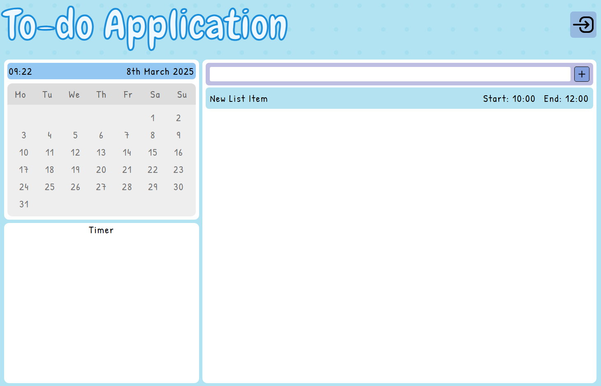
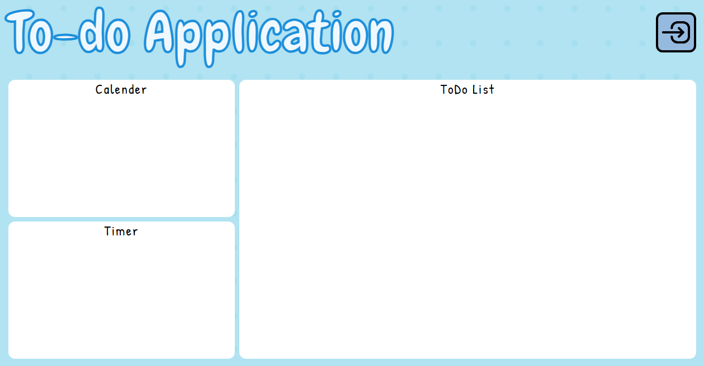
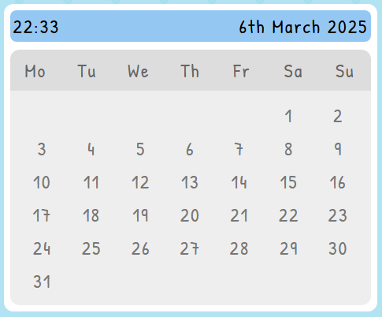

# ToDo Web Application
## Current Look of Website

I want to create a web application for creating to-do lists, not just a simple to-do list I want to add features such as:
- calender sync
- Kanban Board
- Pomodoro (Timer)
- Sign in with Google Login
- Habit Tracker
- Adding to-do with date / time / priority / tags
- Filter System to view old and new tasks.

Css Generator for Grid Layouts:
[CSS Grid Generator](https://cssgridgenerator.io/)

## TODO List
In the to-do list section, I want to add tasks which will hold data such as the title, date, time, associated tags such as 'work', uncheck/check status this will grey out the task if the task has been achieved.

## Calender
The calender will hold all the information for each day, such as each day upon clicking on it will show all the to-do list tasks in chronological order within the page.
- Get the Month
- Get the Year
- Show all the days with the associated Month(February) and Year(2025).
  

## Timer
A simple timer which will have an alert function with sound which will be handy when completing tasks in a timely manner.